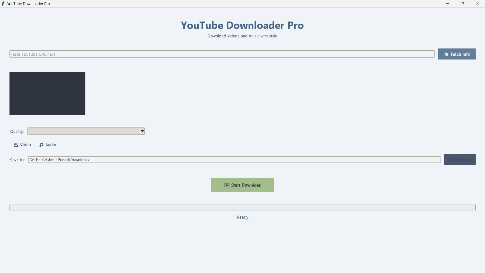

# 🎥 YouTube Downloader Pro

A modern, elegant YouTube video downloader with a sleek GUI. Download videos and playlists in your preferred quality with just a few clicks! 

## ✨ Features

- 🎬 Download YouTube videos in various qualities (up to 4K)
- 🎵 Extract audio in high-quality MP3 format
- 📋 Support for playlist downloads with selection
- 🎨 Modern, eye-friendly interface with animations
- 📊 Real-time progress tracking with detailed status
- 🖼️ Video thumbnail preview
- 💫 Smooth animations and visual effects
- ⚡ Fast downloads with yt-dlp engine
- 🛡️ Built-in error handling and user guidance

## 🚀 Quick Start

1. Download the latest release
2. Extract the "YouTube Downloader Pro" folder
3. Run "YouTube Downloader Pro.exe"
4. Start downloading! No installation needed!

## 🎯 How to Use

### Single Video Download
1. 📋 Copy your YouTube video URL
2. 📥 Paste it into the app
3. ✨ Click "Fetch Info"
4. 🎯 Select your preferred quality
5. 📂 Choose save location (optional)
6. ⚡ Click "Start Download"

### Playlist Download
1. 📋 Paste the playlist URL
2. 📑 Select videos from the playlist
3. 🎯 Choose quality settings
4. ⚡ Start downloading

## 🎨 Interface Features

- 🌈 Modern, eye-friendly color scheme
- 📊 Smooth progress animations
- 💡 Intuitive controls and feedback
- 🎯 Clear status indicators
- 🖼️ Video thumbnail previews

## 🛠️ Technical Details

Built with:
- 🐍 Python 3.7+
- 📦 yt-dlp for downloads
- 🎨 Tkinter for GUI
- 🖼️ Pillow for image processing
- 🎬 FFmpeg for media processing

## 📝 Requirements

- Windows 7/8/10/11
- No Python installation needed
- No additional software required
- Everything included in the package!

## ⚙️ Advanced Features

- 🎚️ Quality selection for both video and audio
- 📂 Custom save location support
- 🎯 Progress tracking with speed display
- ⚡ Concurrent downloads for playlists
- 🛡️ Error recovery and retry mechanism

## 🚨 Troubleshooting

If you encounter issues:
1. 🔍 Check your internet connection
2. 📁 Verify the ffmpeg folder is present
3. 📝 Ensure write permissions in save location
4. 🔄 Try restarting the application

## 🤝 Contributing

Contributions are welcome! Feel free to:
- 🐛 Report bugs
- 💡 Suggest features
- 🔧 Submit pull requests

## 📜 License

This project is licensed under the MIT License - see the [LICENSE](LICENSE) file for details.

## 🙏 Credits

- 🎬 [yt-dlp](https://github.com/yt-dlp/yt-dlp) for the download engine
- 🎨 FFmpeg for media processing
- 📦 All the awesome Python packages used

## 📱 Future Plans

- [ ] Dark/Light theme toggle
- [ ] Custom theme support
- [ ] More download options
- [ ] Download scheduling
- [ ] Browser extension integration
- [ ] Mobile compatibility.

## ⚠️ Disclaimer

This tool is for personal use only. Please respect YouTube's terms of service and content creators' rights. Only download content that you have permission to download.

---
Made with ❤️ by Manas Shukla.
